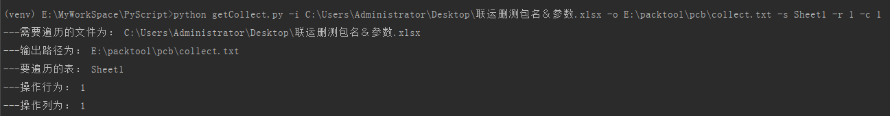
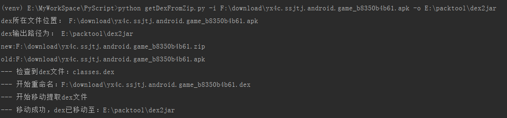
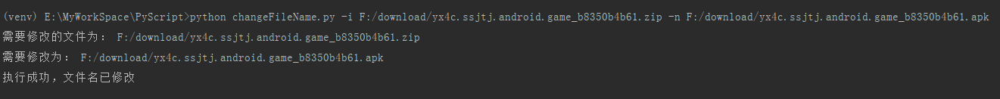
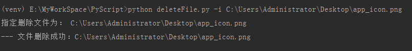

# PyScript
## 一些个人工作，包括配合打包工具执行的一些Python脚本整合

### 遍历excel文件获取信息：getCollect.py
#### Cmd/Terminal调用：python getCollect.py -i inputfile -o outPutFile -s sheet -r row -c column
#### 运行结果

### 获取apk中的dex文件：getDexFromZip.py
#### Cmd/Terminal调用：python getDexFromZip.py -i dexFile -o outputFile
#### 运行结果

### 修改文件名：changeFileName.py
#### Cmd/Terminal调用：python changeFileName.py -i fileName -n newName
#### 运行结果

### 删除指定文件：deleteFile.py
#### Cmd/Terminal调用：python deleteFile.py -i deleteFile
#### 运行结果

